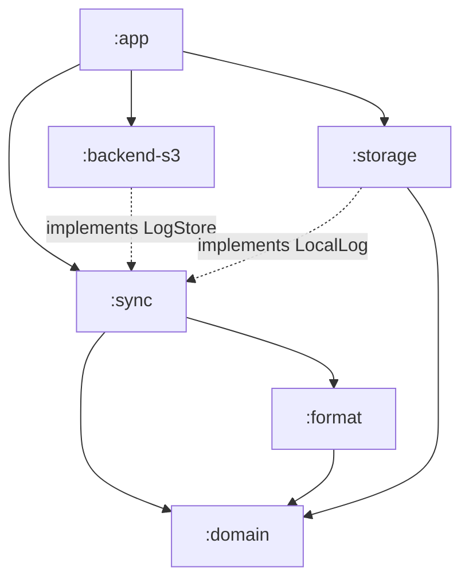

# Architecture

**Status:** Draft. Where the code lives and why it lives there. The modelling
approach behind it is in [development.md](development.md); what the code has to
do is in [technical-requirements.md](technical-requirements.md).

---

## 1. Modules, not packages

The boundary between the domain and everything else is the one structural
decision worth paying for, and a package boundary is advisory: nothing stops a
domain class importing Android, and eventually one does. A module boundary is a
compile error. The modules here are small — some will be a few hundred lines —
so the cost is a `build.gradle.kts` each, and the benefit is that `:domain`
_cannot_ see a database.



| Module        | Kind                | Holds                                                                                               |
| ------------- | ------------------- | --------------------------------------------------------------------------------------------------- |
| `:domain`     | Kotlin JVM          | the group aggregate, entries and sides, split arithmetic, balances, recurrence, event types, replay |
| `:format`     | Kotlin JVM          | the wire format: JSON codec, the parser limits, age encryption, the hash chain, derived ids         |
| `:sync`       | Kotlin JVM          | the sync algorithm, and the ports it needs: `LogStore`, `LocalLog`                                  |
| `:backend-s3` | Kotlin JVM          | HTTP, SigV4, `ListObjectsV2`, `If-None-Match`, the backend probe                                    |
| `:storage`    | Android library     | SQLite: local event log, retained object bytes, projections, settings, credentials                  |
| `:app`        | Android application | Compose UI, ViewModels, WorkManager scheduling, the composition root                                |

Dependencies point inward. `:sync` declares what it needs as interfaces and
never learns which implementation it got; only `:app` knows that `LogStore` is
S3 today (TR-29, BE-14). The one caveat is TR-23: if the age answer turns out to
be a gomobile AAR rather than a Kotlin library, `:format` becomes an Android
library, and the port in front of the age binding keeps that from spreading
further than its dependents.

Modules get created when there is code to put in them. Starting with `:domain`
and `:app` and splitting outward as the sync path arrives is not a departure
from this; it is the same structure, arrived at in the order the work happens.

## 2. Folder structure

```text
neugesplitter/
├── docs/
├── gradle/libs.versions.toml
├── domain/src/main/kotlin/eu/teele/neugesplitter/domain/
│   ├── value/        Amount, MemberId, EntryId, Scale, EntryDate
│   ├── group/        Group aggregate root, Member, group settings
│   ├── entry/        Entry, Kind, Side, Scheme, the split arithmetic
│   ├── recurrence/   Series, Segment, Interval, occurrence expansion
│   ├── balance/      balances and the settlement rounding of format-spec 7.1
│   ├── event/        the sealed event hierarchy of format-spec 4.2
│   └── replay/       applying events in order to produce group state
├── format/src/main/kotlin/eu/teele/neugesplitter/format/
│   ├── json/         envelope and payload codec, JSON restrictions, parser limits
│   ├── chain/        chainKey, prev, verification
│   ├── crypto/       AgeCodec port and binding, key pair, passphrase generation
│   └── derived/      occurrence ids
├── sync/src/main/kotlin/eu/teele/neugesplitter/sync/
│   ├── LogStore.kt   the backend port: createIfAbsent, get, listFrom, putAttachment
│   ├── LocalLog.kt   the retention port: retained bytes in, retained bytes out
│   ├── writer/       batching, conditional write, batch-id recovery
│   ├── reader/       listing, truncation detection, verify-then-apply
│   ├── restore/      explicit restore from retained bytes
│   └── probe/        backend acceptance check
├── backend-s3/src/main/kotlin/eu/teele/neugesplitter/backend/s3/
├── storage/src/main/kotlin/eu/teele/neugesplitter/storage/
│   ├── events/       the canonical local event log and sync-state tracking
│   ├── objects/      the retained bytes table
│   ├── projection/   the derived tables and their DAOs
│   └── settings/     backend settings, keystore-backed credentials
└── app/src/main/kotlin/eu/teele/neugesplitter/
    ├── MainActivity.kt
    ├── AppGraph.kt   the composition root: everything is constructed here, once
    ├── work/         WorkManager scheduling
    └── ui/           one package per screen, each a Composable plus a ViewModel
```

There is no `data` / `domain` / `presentation` trio inside each module. The
module _is_ the layer.

## 3. Where a given concern lives

| Concern                                       | Module                      | Reference            |
| --------------------------------------------- | --------------------------- | -------------------- |
| Splitting a side, deriving balances, rounding | `:domain`                   | format-spec 7, TR-33 |
| Which occurrences a series is due             | `:domain`                   | event-model 6        |
| Serialising an event, enforcing parser limits | `:format`                   | TR-39                |
| Encrypting, decrypting, chain verification    | `:format`                   | TR-26a, TR-26b       |
| Retaining exact bytes                         | `:storage`, port in `:sync` | TR-17                |
| Picking the next number, conditional write    | `:sync`                     | sync-design 4        |
| Detecting truncation, halting                 | `:sync`                     | TR-40                |
| SigV4, addressing style, mapping `412`        | `:backend-s3`               | TR-28, TR-30         |
| Polling schedule, debounce                    | `:app/work`                 | TR-9, TR-14          |
| Locale formatting, the calculator's UI        | `:app/ui`                   | TR-34, TR-35         |

The calculator is a split: evaluation is `:domain` arithmetic in 10⁻⁸ units, the
keypad is UI.

## 4. Two paths through the system

**Recording an entry.** The ViewModel loads the group, and the aggregate
validates the input and _returns_ an event rather than mutating itself. That
event is stored first in the canonical local event log as JSON text, and the
projection is updated from it in the same transaction, so the screen is correct
before any network exists (TR-6, TR-7, TR-17b). Unsynced local events carry only
local ordering and sync state; they are not yet committed to backend object
numbers and may still be batched or reordered when sync eventually runs. Later,
a bounded debounce closes the batch (TR-14); `:format` serialises those pending
events into one backend object, chains and encrypts it; `:sync` asks for a
conditional write at the next number. Once the write is confirmed, the exact
object bytes are retained and linked back to the events they carried. A `412`
means someone else took that number: fetch the winner, apply it, rebuild the
object so its chain link points at the new predecessor, keep the batch id, and
try again (TR-26c).

**A sync pass.** List from one number below the highest object held, and require
that object to still be there — a backend that comes back shorter halts the
group and is never written to (TR-40). Then, for each new object: fetch,
decrypt, verify `prev` before anything is applied (TR-26a), parse inside the
limits (TR-39), keep the exact bytes (TR-17), append the carried events to the
local event log, apply them in order through domain replay, update the
projection, and record which events came from which retained object. Finally
push anything local the backend does not have yet.

When sync assigns backend numbers to formerly provisional local events, or when
it inserts remote events ahead of them, the projection does not necessarily need
a full rebuild. Storage keeps references from events to the derived items they
last fed, so sync can ask the domain which items and downstream consequences are
now invalid and rebuild that slice only. The references are bookkeeping; the
domain still decides whether a shifted event changes an entry row, occurrence,
balance, or nothing visible at all.

Both paths run under one mutex per group, because a deferred background poll
will eventually fire while a manual sync is running (TR-15).

## 5. Local storage

| Table              | Derived? | Notes                                                                  |
| ------------------ | -------- | ---------------------------------------------------------------------- |
| `event_row`        | no       | group, local order, canonical event JSON text, sync state, object link |
| `log_object`       | no       | group, number, batch id, exact bytes as the backend holds them         |
| `event_item_ref`   | no       | event-to-projection references used to find partial rebuild candidates |
| `backend_settings` | no       | endpoint and prefix; credentials encrypted with a keystore key (TR-36) |
| `sync_state`       | no       | last successful sync, halt state and its reason                        |
| everything else    | yes      | group, member, entry, side, series, occurrence, balances               |

The local event log is the installation's source of truth for a group, and the
retained backend objects are the source of truth for restore and chain
verification. The derived tables can be dropped and rebuilt from `event_row` at
any time, and that is the resolution to any disagreement between them (TR-18,
TR-18b). Day to day, partial invalidation starts from `event_item_ref`, but the
domain decides how far the rebuild propagates (TR-18aa, TR-18c). Deleting a
group deletes both halves (TR-20).

## 6. Lifecycle and threading

The unlocked identity lives in memory for the session and never on the path of
reading an object (TR-26). Background polling goes through WorkManager and
tolerates arbitrary deferral; manual sync calls the same code directly rather
than scheduling it (TR-13). No foreground service, no battery-optimisation
exemption (TR-11).

## 7. UI

Compose, one ViewModel per screen exposing a single immutable state object, fed
by Flows off the projection. No UI path awaits a network call — sync is
something the state reports, not something a button waits for (TR-6, TR-8,
SY-6). Screens read the domain types directly where they fit, and get their own
model only where the screen genuinely differs in shape from the aggregate. SQL
may help find candidate rows to replay or display, but the meaning of an event —
that it changes an entry, a balance or an occurrence — is decided only in the
domain module (TR-18a).

## 8. Not part of the architecture

- **No cross-group anything.** No global member identity, no aggregation across
  groups, no shared settings that a group's replay depends on.
- **No repository for entries in the domain.** Entries are reached through their
  group, or read from the projection for display.
- **No sync service abstraction over "cloud providers".** There is one backend
  port with four operations, and S3 is currently its only implementation.
