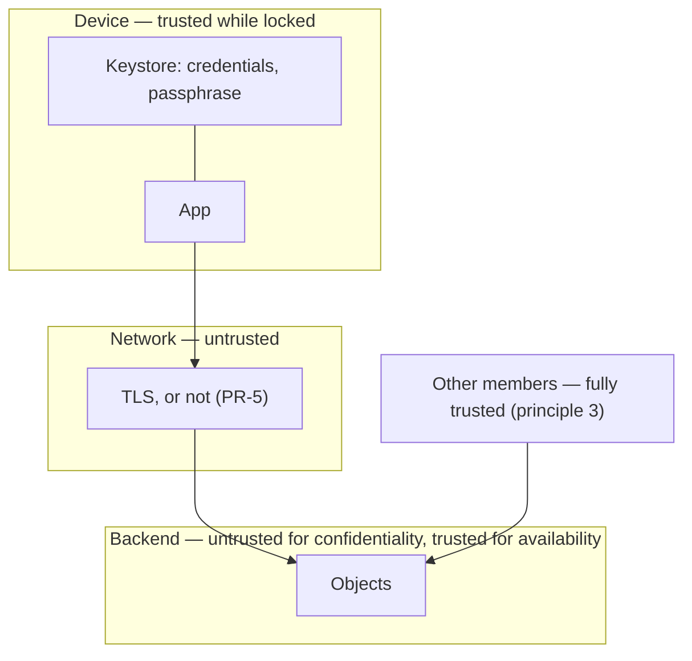

# Threat Model

**Status:** Draft. Consolidates security claims that are currently scattered
across [product-requirements.md](product-requirements.md) section 4.11,
[sync-design.md](sync-design.md) sections 9 and 10, and
[format-spec.md](format-spec.md) section 5.

This document is written to be uncomfortable. Its purpose is to say what the
design does _not_ protect, precisely enough that nobody has to discover it
later.

---

## 1. What is being protected

- **Group content**: Descriptions, amounts, dates and member names describe a
  household's finances and a small circle's social life.
- **The passphrase**: Sole protection of group content on rented storage,
  recoverable from nobody (PR-12).
- **Backend credentials**: Full read and write access to the group; also the
  users' own storage account.
- **The history**: Principle 3 replaces permissions with an immutable history.
  If it is not trustworthy, nothing else is.
- **Availability of the history**: A group that cannot be read is a group that
  cannot be settled.

Explicitly **not** protected, and not intended to be: anonymity from the storage
provider, the contents of a device somebody else is holding, and anything at all
against a member of the group.

## 2. Trust boundaries

The most important thing this picture shows is what is missing: there is no
boundary between "holds the credentials" and "is a member of the group". **The
security boundary is the credential, not the member list.**

## 3. Adversaries

- **Adversary** (Capability): What limits them
- **Storage provider** (Read, modify, delete, withhold every object; observe
  every request): Encryption (PR-11) for content; nothing for metadata,
  availability or deletion
- **Network observer** (Read and modify traffic): TLS; nothing if the user
  accepted a plain-HTTP backend (PR-5)
- **Holder of leaked credentials** (Everything a member can do): Nothing. They
  _are_ a member as far as the system is concerned
- **A member** (Write any event, including events attributed to others):
  Nothing, by design (GR-10, principle 3)
- **Thief with an unlocked device** (Everything): An app lock, which is Optional
  (PR-13)
- **Thief with a locked device** (Nothing directly): Device encryption and
  Keystore (PR-6)
- **This project's authors** (**None**): There is no server to compel, subpoena
  or breach (PR-1)

That last row is the design's strongest security property and the reason for
most of its awkwardness. It is structural rather than promised: there is no
infrastructure, so there is no capability to misuse.

## 4. Findings

### TM-1 The log can be truncated, and a new installation cannot tell

Objects are chained: each carries a keyed hash of the previous object's payload
(format-spec 5.3), so insertion, reordering, substitution and starting a fresh
history are all detected. What remains is **truncation**. Removing the last _k_
objects leaves a chain that verifies perfectly, and a fresh installation has no
idea how long the history should have been.

Limits: an installation that has already synced can detect it, because it lists
from below the highest number it holds on every pass and expects that object to
come back (TR-40). A credential without delete permission moves this capability
from "any member" to "the provider only".

The answer to the rest is repair rather than detection. Every installation
retains the objects it downloaded, byte for byte and still encrypted (TR-17), so
a shortened log is put back by re-uploading the missing numbers unchanged. What
the app does not do is decide that by itself: syncing stops, the group stays
usable locally, and a person says what should happen (SY-15, sync-design section
7). For this to fail silently, every installation in the group would have to be
missing the same tail — which means nobody ever saw the lost entries, and a
group in that state has lost nothing anyone noticed.

Residual: a genuinely fresh installation joining a truncated group, with nobody
synced enough to notice, has no defence. Closing that would need an expected
length carried outside the log, which is a second source of truth, a second
thing to keep in step and a second thing to attack. It is not worth it for a
window this narrow.

### TM-1a A key pair could let an outsider write a decryptable object

Encrypting to a public key normally hands the ability to write something
readable to anyone who has that key. Here nobody does: the root object is the
private key encrypted to the passphrase, and the public key is derived from it
rather than stored (format-spec 2.1). Someone with read access to the bucket
sees an armoured age file and cannot get a recipient out of it, so writing and
reading remain gated by the same secret.

The chain is the second line: a forged object needs the link of its predecessor,
which is a MAC under a key derived from the private key. That cannot be computed
from read access, nor from a plaintext an attacker has somehow learned, because
the link is keyed rather than a bare hash. It also constrains what read access
_does_ allow without any key at all — copying existing ciphertext objects to
other positions — which is why `prev` MUST be verified on every object.

### TM-2 Anyone with the credentials is indistinguishable from a member

There is no per-member authentication, so credential disclosure is total
compromise: read everything, write anything, forever. Removing a member (GR-6)
removes nothing (BE-13), and the only revocation is rotating the credential and
having every member re-enter the settings.

This follows directly from BE-5 — joining requires nothing but the same settings
— and cannot be fixed without the key exchange the product deliberately does not
have.

### TM-3 Authorship is unauthenticated

Any writer can produce an event with `by` set to any member. The history
therefore records what somebody _claimed_, not what happened.

This matters more than it first appears. Principle 3 offers the history _in
place of_ permissions — it is the stated safeguard. That safeguard is sound
against mistakes, which is what it was designed for, and provides nothing
against a malicious member, who can attribute a fabricated expense to somebody
else and leave no trace. Fixing it needs per-member signing keys, which needs
key distribution, which is exactly what BE-5 rules out.

Nothing is done about it, and nothing should be. `by` is the member the user
picked at setup (BE-6), written so the others can see who added what; somebody
willing to deceive their household picks a different one, exactly as they could
invent the expense in the first place. The credential is the boundary (TM-2),
and inside it the group is people who trust each other. Hedging every name in
the interface would advertise a doubt the product does not have.

### TM-4 The passphrase usually travels beside the settings it protects

Encryption assumes the provider does not have the passphrase. In practice a
member sends the backend settings to the others through some chat app, and the
passphrase follows in the next message. Anyone who reads that conversation — or
the chat provider, or a backup of it — has both.

decisions.md already records that the app must give no help with this transfer,
for exactly this reason. That is the correct decision and it is not a
mitigation: it makes the app not _worsen_ the problem, while leaving the
problem.

### TM-5 Hostile event content can break every device in the group

Events are attacker-controlled JSON written by anyone with credentials, and
every installation parses them automatically. A single object containing a
deeply nested structure or a hundred-megabyte string would otherwise be enough
to make the group unopenable on every device at once, permanently, since nothing
can be deleted.

This is a direct consequence of choosing a self-describing text format and was
straightforward to close. The specification now sets hard limits — 8 MiB per
object, depth 32, 64 KiB per string, 10 000 events — enforced while parsing
rather than after (format-spec 2.2, TR-39).

Residual: an object over the limits still stops the log, because applying what
came after it would mean one device's balances disagreeing with everyone else's.
That is a denial of service by a member who already has one (TM-10), and the way
out is the same: rebuild at a fresh location.

### TM-6 Attachments are attacker-controlled bytes fed to an image decoder

EN-11 is `Later`, so nothing is built yet. Platform image decoders are a
recurring source of memory-corruption vulnerabilities, and here the input
arrives automatically from shared storage rather than from a file the user
chose.

Accepted. An attachment comes from somebody who already holds the credentials
and can do far worse with an event, and content addressing (format-spec
section 9) proves the bytes are the ones that member uploaded rather than
something the provider substituted. That puts it inside the boundary this whole
design draws at the credential. Every browser on the same device decodes far
more hostile images all day. What remains is a resource question rather than a
security one — an attachment large enough to exhaust memory — which TR-41
bounds.

### TM-7 Encryption hides content, not behaviour

Even with PR-11 in force, the provider learns that a group exists, when it was
created, how many objects it has, how large each is, and when each member's
device syncs. Object sizes reveal batch sizes; access times reveal roughly where
people live and when they are awake. Groups sharing one bucket under different
prefixes (a case decisions.md explicitly supports) are visibly the same
customer's.

Ordering requires readable object names, so this is accepted rather than solved.

### TM-8 A plain-HTTP backend puts the credential on the wire on every request

What travels in the clear is the credential, the object names and sizes, and —
for an unencrypted group — everything the objects say. An encrypted group loses
only the first two: the objects are age files on the wire exactly as they are at
rest, so an observer gains nothing a reader of the bucket would not already
have. The credential is the real loss, and it is total (TM-2).

PR-5 requires a warning, and the warning is the entire control. This is
defensible for a NAS on a home LAN and indefensible on café Wi-Fi, and the app
cannot tell which it is looking at. The warning should describe the consequence
rather than the protocol.

### TM-9 Passphrase strength

Anyone who can read the bucket can attempt an offline brute-force against the
root object, which is the private key encrypted to the passphrase. age's scrypt
work factor makes each guess expensive, which converts the question into one
about the passphrase itself. The work factor is age's to choose, not ours, so
there is no parameter here to turn up in compensation.

The passphrase is therefore generated rather than invented: six words or more
from a list of at least 7 776, drawn with the platform's secure generator, which
is around 77 bits and beyond offline search at any scrypt cost (PR-12a, TR-25a).
A user who insists on their own gets a warning and not a refusal (PR-12b) — it
is their storage and their group.

Residual: a passphrase this strong has to be written down somewhere, which moves
part of the problem to wherever that is, and to TM-4.

### TM-10 A member can vandalise the location irreparably

Nothing is ever deleted and the credential is shared, so a member acting in bad
faith can append unlimited garbage, or claim an object number far ahead of the
group's position. Nothing can be undone in place. The recovery is SY-11: rebuild
the group at a fresh location from any installation's copy, and rotate the
credential.

This is the trust model working as intended. It is worth stating so that
"immutable history" is not mistaken for "tamper-proof storage".

### TM-11 Broken device entropy would be catastrophic

age generates a fresh file key per object and an X25519 ephemeral share with it,
so a device with a badly seeded generator — a cloned image, or a fault early in
boot — could repeat one and disclose plaintext. The same generator produces the
group's key pair in the first place, where a repeat would be worse still.
Android's `SecureRandom` is the mitigation and is adequate.

## 5. Controls that exist

- **No server operated by this project** (PR-1, PR-2): limits the authors as
  adversary
- **Passphrase encryption, off by default** (PR-4, PR-11): limits provider
  reading content
- **The passphrase is generated, not invented** (PR-12a): puts offline search
  out of reach
- **Hard parser limits** (format-spec 2.2): prevents one object breaking every
  device in the group
- **Encryption is age, not our own construction** (format-spec 5): limits design
  errors nobody would ever be able to correct
- **The public key is derived, never stored** (format-spec 2.1): prevents an
  outsider encrypting to the group
- **Keyed hash chain over object payloads** (format-spec 5.3): prevents
  insertion, reordering, transplanting between groups or positions, a forged
  history
- **Credentials in platform secure storage** (PR-6): prevents leaking to other
  apps, backups
- **TLS, with a warning otherwise** (PR-5): limits network observers
- **Credential scoped to one prefix, no delete permission** (sync-design 10):
  prevents members deleting history; narrows TM-1
- **Every installation holds the whole history** (SY-11): limits deletion,
  truncation, vandalism
- **Content-addressed attachments** (format-spec 9): limits substituted
  attachments
